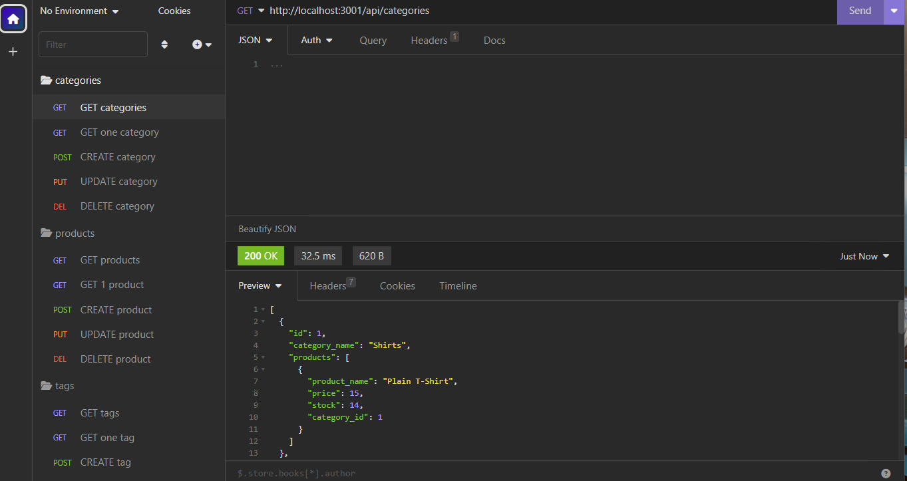
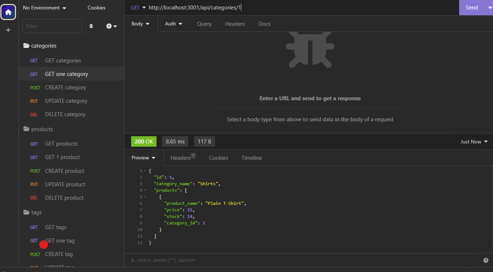
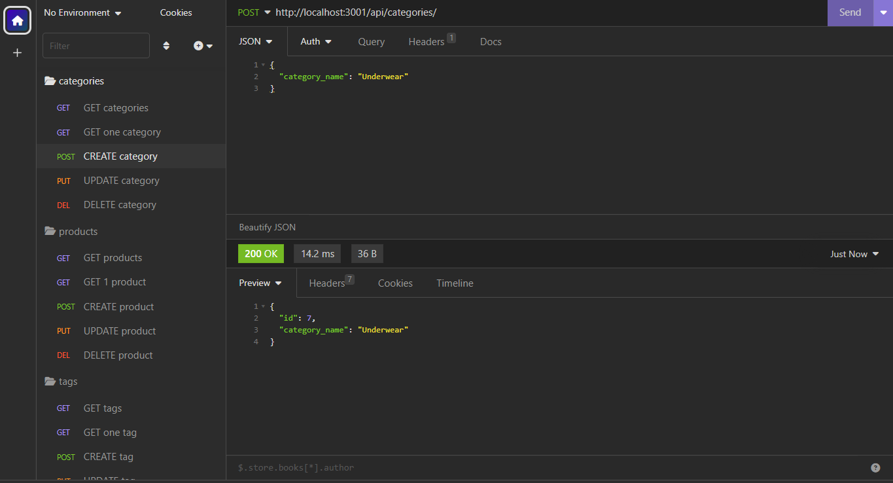
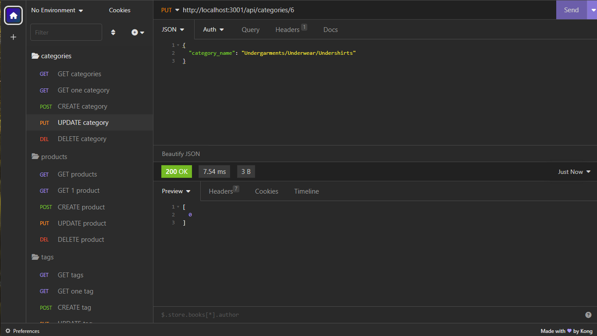

# E-Commerce Back End

## Description

This is a back end for an example e-commerce site. It uses Express.js API and Sequelize to interact with a MySQL database.

## Table of Contents

* [Installation](#installation)
* [Usage](#usage)
* [Demo](#demo)
* [Contributing](#contributing)
* [Questions](#questions)

## Installation

To install necessary dependencies, run the following command:

```bash
npm i
```

Make sure to set up your MySQL database and create a .env file with your MySQL username, password, and database name.

Make sure to create a .env (already created for you with env.example) file with your MySQL username, password, and database name. Then run the following command to seed the database:

After you have created the database with the schema.sql file, Do this by running the following command:

```bash
mysql -u root -p
```

```bash
SOURCE db/schema.sql
```

then exit mysql and run the following command to seed the database:

```bash
npm run seed
```

Once you have seeded the database, run the following command to start the application's server:

```bash
npm start 
```

OR

```bash
npm run watch
```

Then use Insomnia Core to test the API routes.

## Usage

This application is used to manage a company's products, categories, and tags. It uses Express.js API and Sequelize to interact with a MySQL database.

## Demo

Demo video of the application can be found by clicking [here](https://youtu.be/yXn7vzir1Ls)

Screenshot of the project






## Contributing

If you would like to contribute to this project, please contact me via [email](habibmaksoud@gmail.com) or [GitHub](https://github.com/mynamebrogrammer).

## Questions

If you have any questions about the repo, open an issue or contact me directly via my [email](habibmaksoud@gmail.com)
